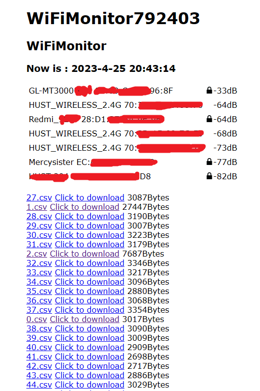

# ESP8266WiFiMonitor

ESP8266实现一个简单的wifi信号监测工具(A simple WiFi signal monitoring tool achieved by ESP8266)

## 1.说明

    这是一个简易的实时wifi信号监测器，面向初学者。

## 2.功能

    1.实时（一定时间间隔）扫描周围的wifi信号，包括SSID、BSSID、信号强度以及是否加密

    2.实时（一定时间间隔）将扫描的信息写入SPIFFS文件系统

    3.提供一个简单的控制台网页（192.168.4.1），可浏览当前扫描得到的WiFi

    4.简易的文件浏览器，可浏览存储的文件及其大小，并可在线浏览以及下载之

    5.存储.csv格式的文件，方便下载后在excel编辑

## 3.不足

    面向初学者，代码和功能尽可能简单，但功能和可控性就很低了，比如不能做到更改AP、不能控制扫面的开始和结束、不能删除文件等等。

## 4.其他信息

#### a.HTML界面

#### b.Arduino设置

#### c.可导出的文件内容

