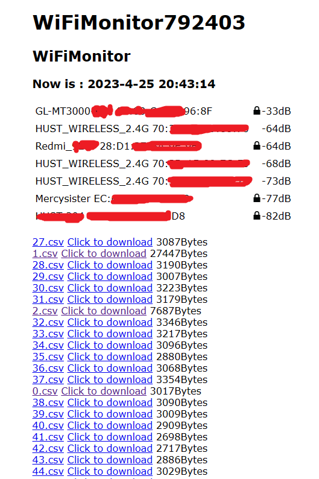

# ESP8266WiFiMonitor

A simple WiFi signal monitoring tool achieved by ESP8266

## 1.Abstract

    This is a simple real-time wifi signal monitor for beginners.

## 2.Feature

1. Scan the surrounding wifi signal in real time (a certain time interval), including SSID, BSSID, signal strength, and whether it is encrypted

2. Write the scanned information to the SPIFFS file system in real time (at a certain interval).

3. Provide a simple console web page (192.168.4.1) to browse the WiFi obtained by the current scan

4. Simple file explorer to browse files and their sizes, and browse them online or download them

5. Store files in .csv format for easy editing in Excel after downloading

## 3.Shortage

    For beginners, the code and functions are as simple as possible, but the functionality and control are very low, such as not being able to change APs, controlling the start and end of scans, deleting files, and so on.

## 4.Other information

#### a.HTML Web page

#### b.Arduino setting

#### c.Files stored in SPIFFS

## 5.If there are bugs or suggestions, put forward them and I may update.
